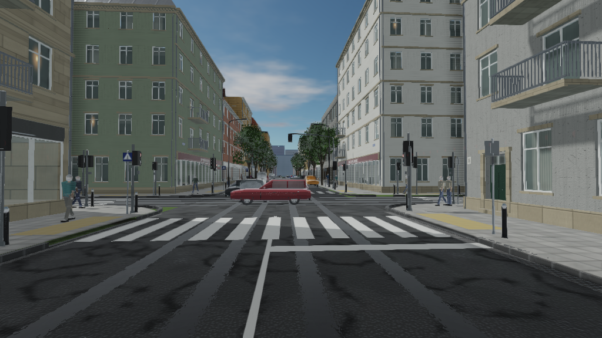
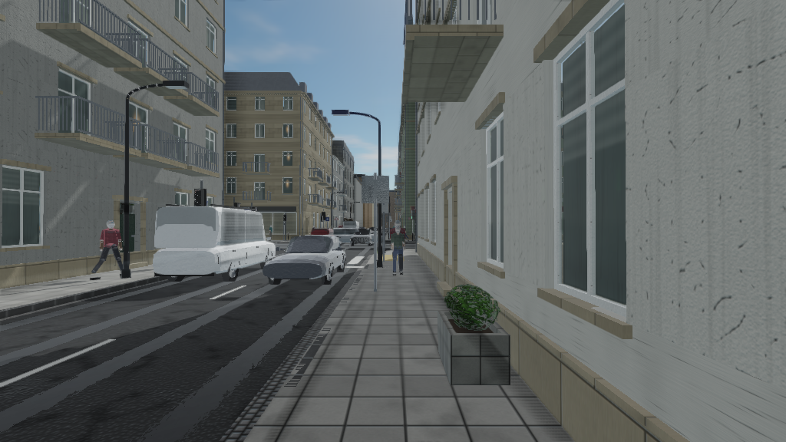
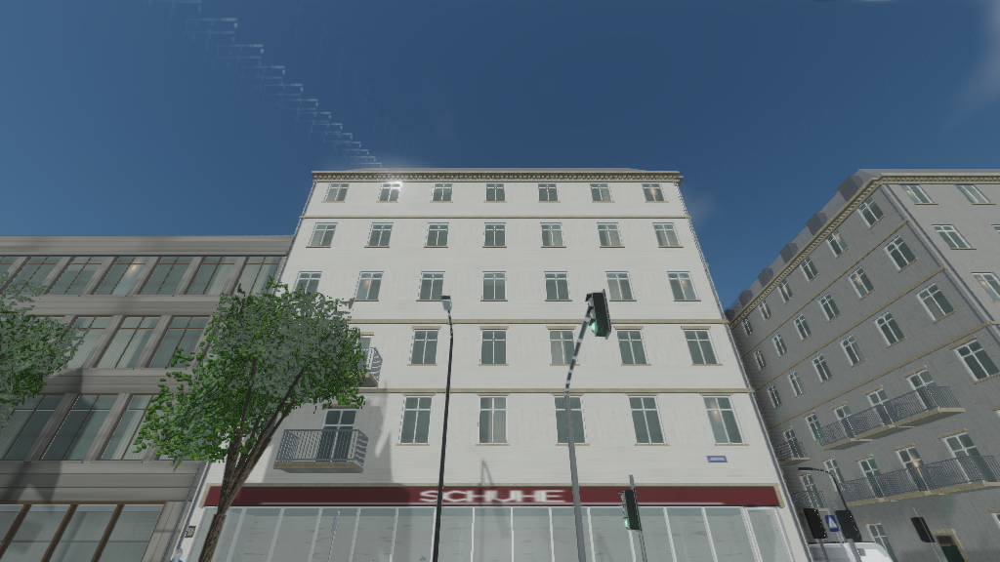
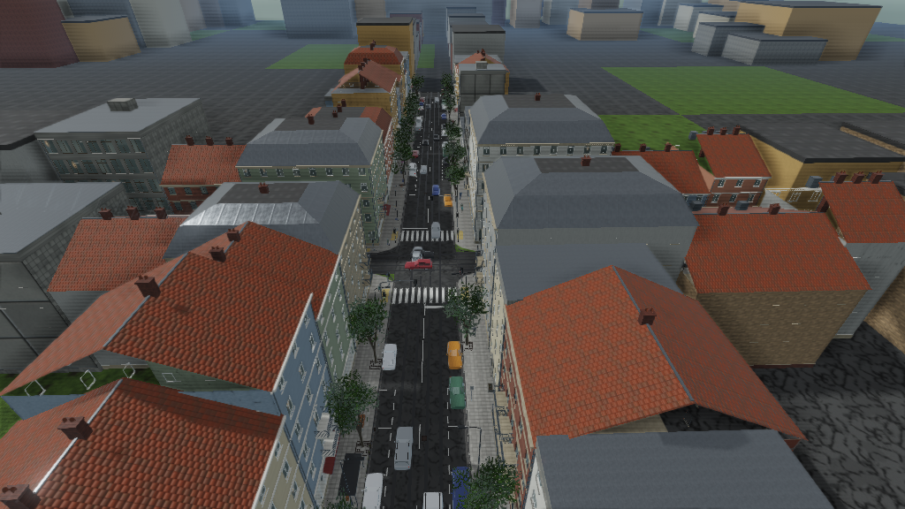
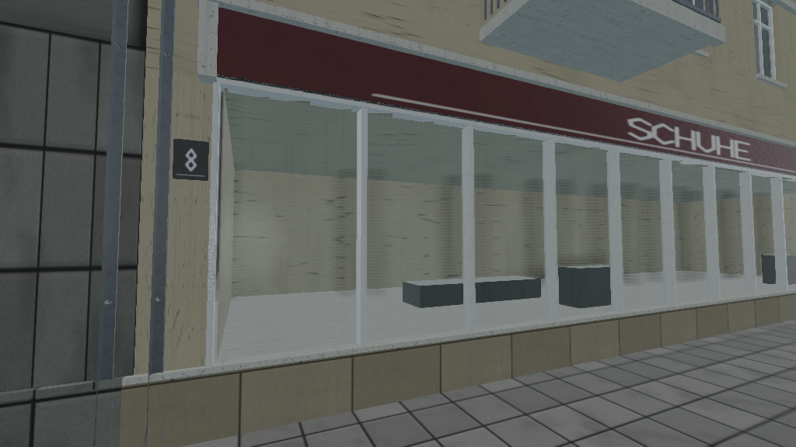

# cna-street

A city street, rendered with [CNA](https://github.com/openeggbert/cna).


One crossroads of a continental-European inner-city street: five-storey
perimeter blocks with shops at street level and flats above, a signalised
junction that actually runs, traffic that stops for it, people who wait at the
kerb for a green man, trees in the footway, and a sky the lighting is derived
from. Everything in it — every texture, every mesh, every letter on every shop
fascia — is generated from one seed by code in this repository. Nothing is
downloaded.

It exists to exercise CNA's modern graphics layer (`CNAEXT`) on something that
is not a test scene: a cascaded shadow pass, a depth/normal prepass, an
analytic sky feeding image-based lighting, an HDR pipeline with SSAO, bloom,
height fog and tone mapping, instanced props, frustum culling, and a full glTF
metallic-roughness material model.

---

## Contents

- [What is in the scene](#what-is-in-the-scene)
- [Screenshots](#screenshots)
- [Building](#building)
- [Running](#running)
- [Controls](#controls)
- [Settings](#settings)
- [Architecture](#architecture)
- [The CNA APIs this uses](#the-cna-apis-this-uses)
- [sharp-runtime](#sharp-runtime)
- [Graphics techniques](#graphics-techniques)
- [The content pipeline](#the-content-pipeline)
- [Assets](#assets)
- [Tests](#tests)
- [Performance](#performance)
- [Known limitations](#known-limitations)
- [Repository layout](#repository-layout)

---

## What is in the scene

**The highway.** A four-arm signalised junction. The main street is a 11.00 m
carriageway — two 3.30 m travel lanes between two 2.20 m parking lanes — with
3.80 m footways; the side street is 6.50 m between 2.60 m footways. Granite
kerbs at 14 cm with a dropped kerb and tactile paving at each crossing, a
granite gutter channel, concrete paving slabs, manhole covers and gully grates.
Centre lines, lane lines, parking bays, stop lines and four zebra crossings,
laid as alpha-masked decals 6 mm above the asphalt. Polished wheel tracks down
each travel lane, resurfaced patches, cracks and oil staining.

**The buildings.** Forty-two plots on eight frontages, in six architectural
families that read as one place built over about 120 years — 1890s rendered
perimeter blocks, brick warehouses, post-war infill, a contemporary office, a
single-storey shop unit, and the heavier corner blocks that turn the junction.
Every window is a real opening: a reveal cut back into the wall, a room behind
it, a frame with a mullion and a transom, glass in front of the frame, a sill
under it. Shopfronts with lettered fascias, awnings, stallrisers, entrance
doors with fanlights, balconies, string courses, three-part cornices, pitched,
mansard and flat roofs with dormers, chimney stacks, gutters and downpipes.

**The street.** Lighting columns with outreach arms, benches, bollards, litter
bins, hydrants, cable cabinets, bicycle stands, planters, a bus shelter. Street
trees with cast-iron grates around their pits. Traffic signals — a near-side
head at each stop line, a far-side repeater, a mast over each main-street
approach, and a pedestrian head at each end of each crossing. Speed limits,
priority plates, crossing signs, parking signs and warning triangles. Street
name plates on the corner buildings and house numbers beside the doors.

**The moving parts.** Ten vehicle meshes over five classes in ten paints, both
parked and driving; the moving ones follow the vehicle ahead and stop for a red
light. Eight people at nine poses each, walking a graph of the footways and the
crossings, waiting at the kerb when the man is red.

## Screenshots

| | |
| --- | --- |
|  |  |
|  |  |
|  |  |

All eight are in `docs/screenshots/`, and `--capture <dir>` rewrites them from
the same viewpoints.

## Building

### What you need

* A C++23 compiler (GCC 13+, Clang 17+, MSVC 19.38+)
* CMake 3.24 or later, and a generator (Ninja is what this is developed with)
* The dependencies below, as **sibling checkouts** of this repository

CNA installs no CMake package, and resolves sharp-runtime, easy-gl and meta-gl
relative to its *own* root, so the layout matters:

```
somewhere/
├── cna-street/       <- this repository
├── cna/              branch: next
├── sharp-runtime/    branch: next
├── easy-gl/          branch: develop
└── meta-gl/          branch: develop
```

`scripts/fetch-dependencies.sh` clones exactly that:

```sh
git clone https://github.com/openeggbert/cna-street.git
cd cna-street
./scripts/fetch-dependencies.sh            # branch tips
./scripts/fetch-dependencies.sh --pinned   # the SHAs in dependencies.lock
```

`dependencies.lock` records the revisions this is developed and verified
against. You are not required to pin them; they exist so that a build failure
can be attributed.

On Debian/Ubuntu the system packages CNA's SDL needs are:

```sh
sudo apt install build-essential cmake ninja-build git \
                 libgl1-mesa-dev libx11-dev libxext-dev libxrandr-dev \
                 libxi-dev libxcursor-dev libxinerama-dev libasound2-dev
```

### The build

```sh
cmake -S . -B build -G Ninja -DCMAKE_BUILD_TYPE=Release
cmake --build build
```

Debug is the same with `-DCMAKE_BUILD_TYPE=Debug`. Both are exercised; Debug is
about eight times slower and is for stepping through the generators, not for
looking at the street.

Useful options:

| Option | Default | What it does |
| --- | --- | --- |
| `CNA_ROOT_DIR` | `../cna` | Where the CNA checkout is |
| `CNA_STREET_RENDERER` | `OPENGL33` | Which CNA renderer to build against |
| `CNA_STREET_BUILD_TESTS` | `ON` | Build and register the unit tests |
| `CNA_STREET_CONTENT_DIR` | `assets/content` | Where the content build writes |

The build turns `CNA_CNAEXT` on for you. Without it every `CNA/Graphics/*.hpp`
header compiles to nothing, with no diagnostic, and the whole modern renderer
silently disappears.

Warnings (`-Wall -Wextra -Wpedantic -Wshadow -Wold-style-cast -Wcast-align`,
and more) are applied to this project's targets only, through the
`CnaStreet::Warnings` interface target — turning them on for a dependency you do
not control produces noise nobody can act on.

There is no IDE dependency and no absolute path anywhere in the build. CLion,
VS Code and a bare terminal all work; Linux is the first-class platform and is
what this is developed and verified on.

## Running

```sh
./build/bin/cna-street
```

Headless, for a screenshot or a whole set:

```sh
xvfb-run -a ./build/bin/cna-street --screenshot street.png --width 1920 --height 1080
xvfb-run -a ./build/bin/cna-street --capture docs/screenshots --no-overlay
```

The command line, in full, is `--help`. The ones that matter:

| Flag | Effect |
| --- | --- |
| `--preset low\|medium\|high\|ultra` | A whole set of quality decisions that make sense together |
| `--settings <file.json>` | Load a settings document |
| `--content <dir>` | Load compiled assets from `<dir>` |
| `--width`, `--height`, `--seed` | Window size and the procedural seed |
| `--viewpoint <n>` | Start at named viewpoint *n* |
| `--camera x,y,z,yaw,pitch` | Start at an explicit camera, in radians |
| `--screenshot <file.png>` | Write one frame and exit |
| `--capture <dir>` | Write every named viewpoint into `<dir>` and exit |
| `--frames <n>` | Render *n* frames and exit |
| `--sun <elev> <azimuth>` | Move the sun, in degrees |
| `--no-shadows`, `--no-ssao`, `--no-bloom`, `--no-fog`, `--no-clouds`, `--no-ibl` | Turn one thing off |
| `--no-traffic`, `--no-pedestrians`, `--no-vegetation`, `--no-overlay` | Leave one thing out |
| `--dump-settings` | Print the effective settings as JSON and exit |
| `--dump-shadow <file.png>` | Write the cascade atlas, which is the only way to tell an empty shadow map from a misplaced one |

A capture or a one-shot screenshot runs the clock at a fixed step, so the frames
it writes depend only on the seed and the frame count. That is what makes
`scripts/check-screenshots.sh` a regression test rather than a diff of two
different moments.

## Controls

| | |
| --- | --- |
| **W A S D** | Move |
| **Mouse** | Look |
| **Q / E** | Down / up |
| **Shift / Ctrl** | Faster / slower |
| **Wheel** | Change the base speed |
| **Tab** | Switch between flying and walking |
| **C** | Cinematic camera, running the viewpoints as a path |
| **1**–**8** | Jump to a named viewpoint |
| **R** | Back to the start |
| **Esc** | Release the pointer |
| **F1** | Debug overlay |
| **F2**–**F6** | Shadows, SSAO, bloom, fog, clouds |
| **F9** | Screenshot |
| **`-` / `=`** | Sun elevation |

In walking mode the camera is at 1.66 m — eye height at the mean adult stature
— it follows the ground up the kerb and onto the footway, and it cannot walk
through a building. In flying mode it goes anywhere.

The debug overlay reports the frame time and its breakdown by stage, draw calls
(total, shadow and instanced), triangles, visible and total batches and
instances, post-process passes, camera position and direction, sun position and
exposure, shadow state, the scene's build statistics, texture and geometry
memory, the renderer, and the version. Turning it off leaves nothing behind.

## Settings

`assets/config/render.json` is loaded at start-up if it is there, overridden by
the command line, and adjustable at runtime with the function keys.
`--dump-settings` prints the effective document, which is the easiest way to
write a new one. An unrecognised key is reported and ignored rather than fatal:
a settings file written for a newer build should still start the demo.

Every quality knob is in there — shadows and their cascade count, resolution,
distance, split distribution and bias; SSAO radius and strength; bloom threshold
and intensity; fog density and falloff; tone mapping operator and exposure; sky
turbidity, cloud coverage and speed; render scale, MSAA and vsync; how far props
are drawn and how far they cast shadows; and whether traffic, pedestrians,
vegetation and street furniture are in the scene at all.

The four presets are sets of decisions rather than one slider. `low` is for a
machine that has to run this at all: no SSAO, no bloom, two cascades at half
resolution, 72 % render scale, props culled at 90 m. `ultra` is the other end.

## Architecture

```
street/
├── Core/       the seeded generator everything draws from
├── Assets/     linear-light images, tileable noise, an SDF canvas, and the
│               generators that turn them into surfaces and sign faces
├── Geometry/   MeshData, MeshBuilder, and the transform helpers
├── Scene/      StreetMetrics, CityLayout, GeometryCollector, CityScene
├── Props/      RoadBuilder, BuildingBuilder, PropFactory, VehicleFactory,
│               PedestrianFactory
├── Sim/        the signal controller, the traffic model, the walk graph
└── Render/     Camera, CameraController, Material, MaterialLibrary, GpuMesh,
                SkySystem, SceneRenderer, DebugOverlay, RenderSettings
```

Three decisions shape most of it.

**`StreetMetrics.hpp` is the single most important file here.** A street reads
as fake long before anyone can say why, and the reason is almost always
proportion. Every dimension in the scene is a named constant in one header with
a note saying where it comes from, and every generator reads them. A sidewalk
you could park on and a car the size of a bus are not bugs you find by looking;
they are bugs you avoid by measuring.

**Static geometry is batched, not scene-graphed.** A street does not move, so
paying for a transform hierarchy every frame buys nothing.
`GeometryCollector` merges geometry per material *within a 34 m grid cell*: one
enormous mesh per material would be one draw call that is always visible and
always fully rasterised, and one mesh per object would be tens of thousands of
draws. The compromise is a few hundred batches that cull.

**Neutral textures, tinted materials.** The plaster, painted-metal, fabric and
car-paint generators produce a *white* surface — all the pattern, none of the
colour — and the colour arrives as the material's base colour. Seven façade
colours cost one texture rather than seven, and the whole vehicle fleet's paint
is one texture. That is the difference between 40 MB of texture memory and
400 MB, and it costs nothing visually, because the pattern really is the same on
a green pole and a grey one.

`docs/design-notes.md` goes further into the parts that are not obvious.

## The CNA APIs this uses

The framework's own surface, used the way XNA 4.0 uses it:

`Game` and its loop, `GameTime`, `GraphicsDeviceManager`, `GraphicsDevice`,
`Viewport`, `RasterizerState`, `BlendState`, `DepthStencilState`,
`SamplerState`, `VertexBuffer`, `IndexBuffer`, `Texture2D`, `RenderTarget2D`,
`SpriteBatch`, `Color`, `Vector2/3/4`, `Matrix`, `Quaternion`,
`BoundingBox`, `BoundingSphere`, `BoundingFrustum`, `Ray`, `Plane`, `Rectangle`,
`MathHelper`, `Keyboard`, `Mouse`, `Keys`, `ContentManager`, `CNA::Logger`.

The modern layer (`CNAEXT`, gated on `CNA_CNAEXT`):

| API | What it does here |
| --- | --- |
| `RenderPipeline`, `RenderPipelineSettings` | The HDR scene target and the whole post chain: SSAO, bloom, height fog, tone mapping, FXAA |
| `CascadedShadowMap` | Four cascades, driven manually so the cull can decide what goes in each |
| `DepthNormalPrepass` | The depth and normal buffers SSAO needs |
| `AtmosphericSky` | The analytic sky model, both as a shader and evaluated on the CPU |
| `EnvironmentProcessor` | Irradiance, prefiltered specular and the BRDF LUT, baked from that sky |
| `PbrEffect` | The glTF metallic-roughness material model, with `TextureTransformEXT`, `AlphaModeEXT`, `IShadowReceiverEXT` and `ImageBasedLightEXT` |
| `InstancedRendererEXT` | Every prop that appears more than once |
| `DirectionalLightEXT` | The sun |
| `GpuTimer` | GPU time per frame in the overlay, where the renderer supports it |
| `FullscreenPass` | The sky shader's draw |
| `RenderQuality`, `ShadowQuality`, `TonemappingMode`, `TransparencyMode` | The vocabulary the settings map onto |
| `SupportsRendererFeatureEXT`, `GetRendererLimitEXT`, `GetRendererCapabilityReportEXT` | Every optional subsystem is *probed*, never assumed, and what the renderer could not provide is listed in the overlay |

Every one of those is doing real work in the frame. Nothing is called to be able
to say it was called.

## sharp-runtime

Used where it is genuinely the right tool rather than because it is linked:

| Component | Where | Why not the standard library |
| --- | --- | --- |
| `System::Random` | `Core/Rng.hpp`, and therefore every procedural decision in the project | .NET's subtractive lagged-Fibonacci generator has a sequence defined by the runtime rather than by a standard-library implementation. `std::uniform_real_distribution` makes no such promise, which is exactly the difference that turns a golden screenshot into a false failure on someone else's machine. |
| `System::Text::Json` | `Render/RenderSettings.cpp` | Reads and writes the settings document. A hand-rolled parser would be a second thing to get wrong, and CNA already carries this one. |
| `System::Diagnostics::Stopwatch` | `SceneRenderer`, `CityScene` | The frame breakdown and the build timings. Its ticks are 100 ns, which is worth knowing before dividing. |
| `System::NotSupportedException` | capability probing | Caught where a renderer refuses a format. |

`Text.Json` and `Numerics` are added to `SHARP_RUNTIME_COMPONENTS` *before*
CNA is added as a subdirectory, because the component list is consumed when
sharp-runtime is configured and setting it afterwards leaves the target
undefined.

## Graphics techniques

**Lighting is linear throughout and sRGB only at the ends.** Textures are
uploaded as sRGB and sampled to linear, every colour constant in the generators
is quoted as an sRGB byte triple and converted once, and the encode back to sRGB
happens exactly once — in `PbrEffect` when it writes to the back buffer, and
*not* when it writes to the HDR scene target, where the pipeline's tone mapper
does it instead. Getting that wrong is subtle and total: with the double encode
a 10:1 albedo ratio rendered as 1.6:1 and the whole street looked washed out.

**Shadows** are four cascades in one atlas, fitted to the view frustum with a
lambda-weighted split distribution, PCF-filtered, blended across the cascade
boundary, and driven manually so that a batch too far away to matter is not
written into a cascade at all. The depth bias is larger than CNA's default for
a good reason: an 8-bit atlas quantises depth at 1/255, which is bigger than
the default bias, so the default acnes.

**The sky** is CNA's analytic model, drawn as a full-screen shader with two
animated cloud decks and a sun disc with limb darkening, and *evaluated again on
the CPU* to bake a 64 px environment cube. That cube goes through
`EnvironmentProcessor` for irradiance, prefiltered specular and a BRDF LUT, so
the image-based lighting is the same sky the camera can see. There is a bounce
term near the horizon, because in a street canyon most of the light arriving at
a north-facing wall has come off the pavement.

**Sun position matters more than sun brightness.** At 38° elevation, 17 m
buildings shadow the entire 18.6 m canyon and the street reads as flat and
sunless. The default is 48°, where the shadow reaches 15.3 m of the 18.6 m
street and there is light *and* shade in the same frame.

**Culling** is per batch and per instance: frustum first, then distance, with
separate distances for being drawn and for casting a shadow. Props stop casting
shadows at 74 m and stop being drawn at 210 m by default.

**Transparency** is avoided wherever a mask will do. Road markings, wheel
tracks, sign faces and foliage are alpha-masked, not blended, so they need no
sorting; only glass is blended.

## The content pipeline

The demo generates every surface at start-up, which takes about eight seconds.
It does not have to:

```sh
cmake --build build --target content
```

That bakes every surface the material catalogue installs to PNG — using the
catalogue itself, through a bake mode that takes a null `GraphicsDevice`,
because generating a surface needs no GPU — and compiles each one to a `.cnb`
with CNA's own `cna_tool_source_to_cnb`. At start-up the demo finds
`assets/content` and loads them through `ContentManager::Load<Texture2D>`
instead. The material stage drops from about eight seconds to about one.

It is an optimisation, not a dependency. A missing or partial content root is
neither an error nor a warning: each surface that is not compiled is generated
as before. The target is not part of `ALL`, and the compiled set is gitignored —
69 MB regenerated from the same seed by two offline tools is a build product.

Both stages are headless and deterministic, and neither needs XNA Game Studio,
MonoGame, FNA or any Visual Studio content tool.

**It needed a change to CNA to be worth having.** Compiled textures had exactly
one mip level — the container has always been able to carry a chain, but nothing
generated one — so the content path made the street look *worse* than the
procedural one. `docs/patches/` carries the CNB commit that fixes it, and
`docs/cna-findings.md` records it as CNA-F12.

`bake-assets --output <dir>` is the same tool's other mode: it writes the
surfaces as a gallery for looking at, which is the only way to work on a texture
on a machine with no GPU.

## Assets

Nothing here was downloaded. See `assets/ATTRIBUTION.md` for what that means and
where each kind of asset comes from.

## Tests

```sh
ctest --test-dir build --output-on-failure
```

Eight suites over the parts of the street that can be checked without a device:
the signal controller, the traffic model, the walk graph, mesh building, the
layout, the settings parser, the camera frustum, and the mip-chain generation
the content pipeline depends on.

The checks are chosen for what a screenshot cannot see. Both arms of the
junction green at once, or a green man across a street whose traffic is running,
are safety properties invisible in a still and asserted at every sample of three
whole cycles. Two plots occupying the same ground is the defect that put a blank
flank wall on all four corners of the junction. A quad wound the wrong way is
visible but lit from behind, which is exactly the kind of wrong that survives
review.

Two of them found live bugs on their first run.

### Screenshot regression

```sh
./scripts/check-screenshots.sh
```

Renders every named viewpoint and compares it with the committed set in
`docs/screenshots`. The scene comes from a seed, the viewpoints are fixed, and a
capture advances the clock by a fixed step rather than by however long the last
frame took, so two runs of an unchanged build are **bit-identical** — the sky's
clouds and the traffic are where the frame count puts them, not where wall-clock
time left them.

The comparison is tolerant on purpose: it allows 2 % of pixels to differ by more
than 8/255, because a driver update or an anti-aliasing decision moves
individual pixels without changing the picture, and an image test that fails on
those is an image test somebody turns off. `TOLERANCE`, `WIDTH`, `HEIGHT`,
`BUILD_DIR` and `REFERENCE_DIR` are environment overrides.

## Performance

The numbers below are from `--preset high` at 1280×720 on **Mesa llvmpipe** —
a software rasteriser, which is what this environment has. They are a profile,
not a benchmark: on any real GPU the shadow and opaque passes are a small
fraction of this.

| | |
| --- | --- |
| Scene build | 8.0 s generating, 1.1 s from compiled content |
| Static batches | 787 |
| Triangles in the scene | 498 276 |
| Geometry memory | 35 MiB |
| Textures | 313 (145 catalogue surfaces plus per-shop signage) |
| Texture memory | 291 MiB |
| Draw calls per frame | ~1 030 opaque and transparent, ~1 650 shadow, 54 instanced |
| Visible batches | 978 of 1 529 |
| Visible instances | 277 of 408 |

Where the frame goes, on llvmpipe: shadows and the opaque pass dominate, the
prepass is a fifth of the opaque pass, culling is 0.2 ms, and the sky is free.
The overlay shows the same breakdown live, and its parts sum to the frame by
construction — they did not always, and a breakdown that does not add up is
worse than none.

What keeps it from being worse: batching by material and cell, instancing every
repeated prop, frustum and distance culling with a shorter leash for shadows
than for drawing, one mip chain on every texture, shared textures behind tinted
materials, and alpha masking instead of blending everywhere except glass.

## Known limitations

* **People are posed, not skinned.** A figure is generated at eight phases of a
  stride and the simulation picks one. CNA *has* skeletal animation, and with an
  authored rigged character it would be the right tool; generating a rigged mesh
  procedurally and a walk cycle to drive it is a much larger piece of work whose
  visible result at the distance a street is seen from is the same figure moving
  the same way.
* **No audio.** CNA's audio module is there and works; the demo has nothing to
  play through it, and a synthesised city ambience would be a worse thing than
  silence.
* **Vehicles do not turn.** Four straight lanes, no lane changes, no turning
  movements. On this street nobody would.
* **The far context is blocks, not buildings.** Past the modelled frontage the
  district continues as massing with a parapet and no windows. It is 200 m away
  and behind everything.
* **`--preset low` is untested on a machine that needs it.** It is built and it
  runs, but the decisions in it are reasoned rather than measured.
* **Reflections are image-based only.** Screen-space reflections are wired to a
  setting and off by default; a shop window reflects the sky and the
  neighbouring massing, not the car parked in front of it.

## Repository layout

```
CMakeLists.txt              the build
cmake/                      dependency location, warnings, the content pipeline
dependencies.lock           the upstream revisions this is verified against
scripts/fetch-dependencies.sh
street/                     the application and its static library
tools/bake/                 the offline surface baker
tools/compare/              the screenshot comparator
scripts/check-screenshots.sh
tests/                      the unit tests
assets/config/render.json   a settings document
assets/ATTRIBUTION.md       where the assets come from
docs/cna-audit.md           what CNA offers, from reading it
docs/cna-findings.md        what did not work, and what was done about it
docs/design-notes.md        the decisions behind the code
docs/patches/               changes contributed back to CNA
docs/screenshots/           the named viewpoints
plan.md                     what is done, what is next
```

## Licence

MIT. See `LICENSE`.
