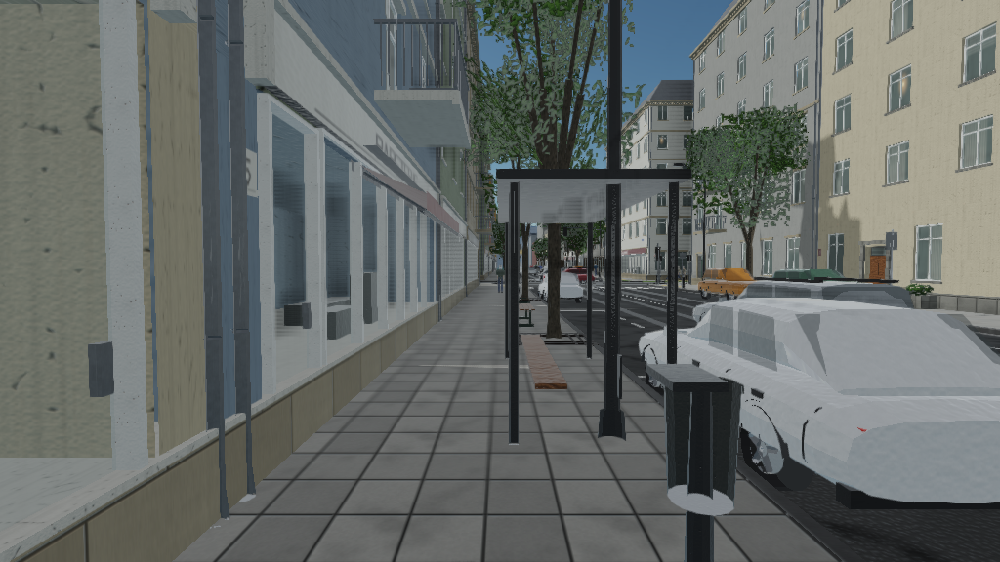
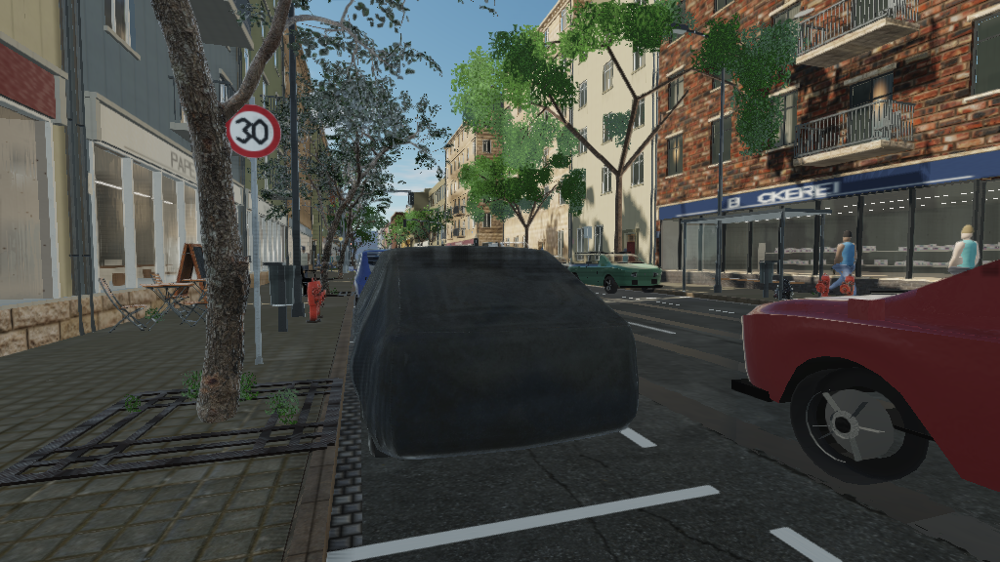
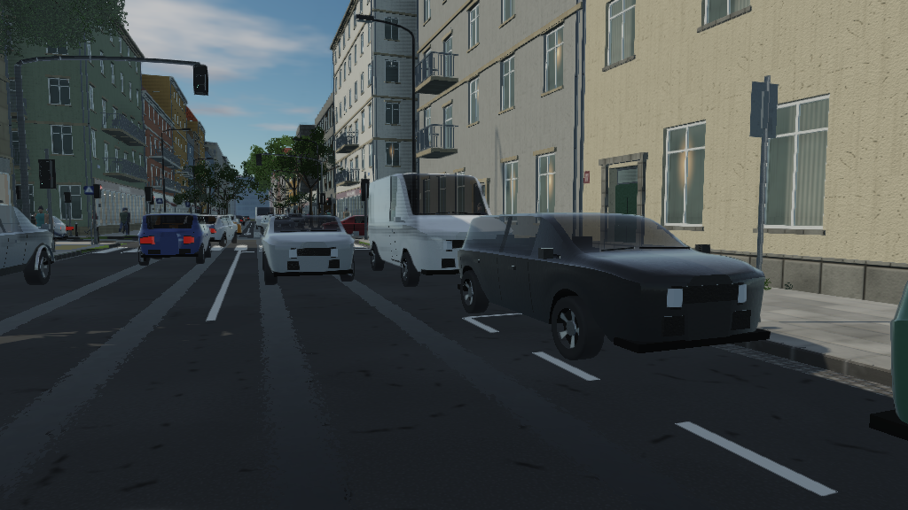
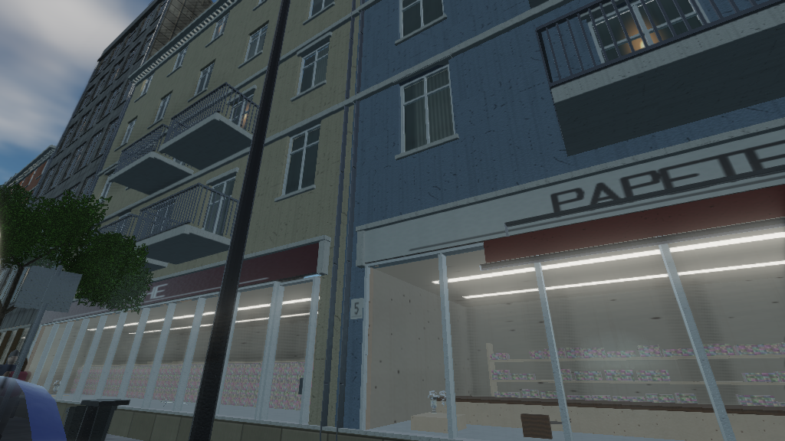
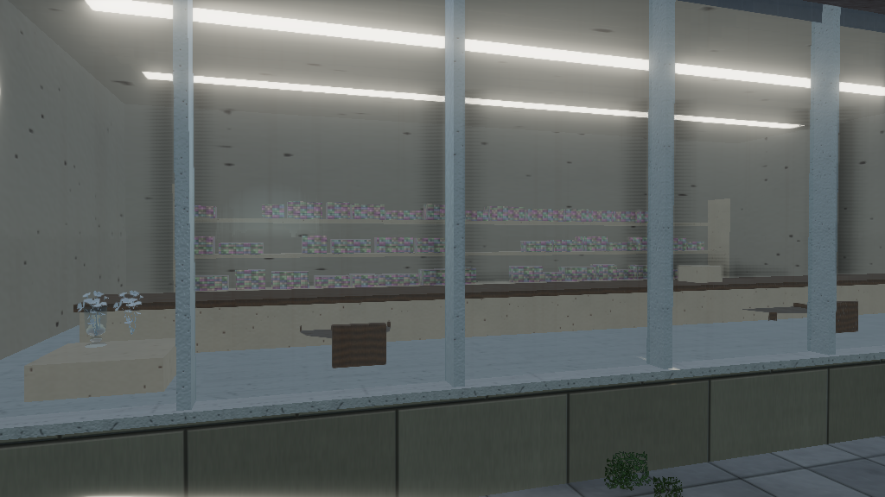

# cna-street

A city street, rendered with [CNA](https://github.com/openeggbert/cna).



One crossroads of a continental-European inner-city street: five-storey
perimeter blocks with shops at street level and flats above, a signalised
junction that actually runs, traffic that stops for it, people who wait at the
kerb for a green man, trees in the footway, and a sky the lighting is derived
from. Every mesh of the street, every marking and every letter on every shop
fascia is generated from one seed by code in this repository. The surfaces the
camera gets closest to -- the asphalt, the paving, the bricks, the render, the
bark -- are photogrammetry scans, and so are the hydrants, the cabinets, the
benches, the cafe tables, the covered car and the trees nearest the showcase
viewpoints: thirty-six models and fourteen texture sets, every one CC0 or
CC-BY, every one with its licence and its digest recorded, every one fetched
rather than committed and standing in for a generated fallback.

It exists to exercise CNA's modern graphics layer (`CNAEXT`) on something that
is not a test scene: a cascaded shadow pass, a depth/normal prepass, an
analytic sky feeding image-based lighting, local reflection probes captured
from the street itself, an HDR pipeline with SSAO, bloom, height fog and tone
mapping, instanced props, frustum culling, and a full glTF metallic-roughness
material model.

---

## Contents

- [What is in the scene](#what-is-in-the-scene)
- [Screenshots](#screenshots)
- [Building](#building)
- [Running](#running)
- [Controls](#controls)
- [Settings](#settings)
- [Architecture](#architecture)
- [The CNA APIs this uses](#the-cna-apis-this-uses)
- [sharp-runtime](#sharp-runtime)
- [Graphics techniques](#graphics-techniques)
- [The content pipeline](#the-content-pipeline)
- [Assets](#assets)
- [Tests](#tests)
- [Performance](#performance)
- [Known limitations](#known-limitations)
- [Repository layout](#repository-layout)

---

## What is in the scene

**The highway.** A four-arm signalised junction. The main street is a 11.00 m
carriageway — two 3.30 m travel lanes between two 2.20 m parking lanes — with
3.80 m footways; the side street is 6.50 m between 2.60 m footways. Granite
kerbs at 14 cm with a dropped kerb and tactile paving at each crossing, a
granite gutter channel, concrete paving slabs, manhole covers and gully grates.
Centre lines, lane lines, parking bays, stop lines and four zebra crossings,
laid as alpha-masked decals 6 mm above the asphalt. Polished wheel tracks down
each travel lane, resurfaced patches, cracks and oil staining.

**The buildings.** Forty-two plots on eight frontages, in six architectural
families that read as one place built over about 120 years — 1890s rendered
perimeter blocks, brick warehouses, post-war infill, a contemporary office, a
single-storey shop unit, and the heavier corner blocks that turn the junction.
Every window is a real opening: a reveal cut back into the wall, a room behind
it, a frame with a mullion and a transom, glass in front of the frame, a sill
under it. Shopfronts with lettered fascias, awnings, stallrisers, entrance
doors with fanlights, balconies, string courses, three-part cornices, pitched,
mansard and flat roofs with dormers, chimney stacks, gutters and downpipes.

**The street.** Lighting columns with outreach arms, benches, bollards, litter
bins, hydrants, cable cabinets, bicycle stands, planters, a bus shelter. Street
trees with cast-iron grates around their pits. Traffic signals — a near-side
head at each stop line, a far-side repeater, a mast over each main-street
approach, and a pedestrian head at each end of each crossing. Speed limits,
priority plates, crossing signs, parking signs and warning triangles. Street
name plates on the corner buildings and house numbers beside the doors.

**Behind the glass.** Every ground-floor unit is a *room*, not a lit plane a
metre back: walls painted to the trade in a front shade and a darker back
shade, shelving loaded with packaged stock, a counter with a till, display
plinths in the window, batten tube fittings across the ceiling, posters and
notices on the walls. What a unit sells is decided once per plot, so the
lettering on the fascia and the fittings behind the window cannot disagree;
some units are vacant with a to-let notice and one in six is shut with a
roller blind three quarters down, because a street where every unit trades is
a street nobody believes. The props on the plinths are imported glTF models
compiled through CNA's own content pipeline.

**What the street reflects.** Twenty-nine reflection probes stand along the
carriageways: the static street captured six ways into a cube from each point
at scene build, convolved like the sky, and read by every draw near it. A
parked car reflects the facade it is parked outside; a shop window reflects
the cars parked in front of it. The glass itself is a reflection layer over
what it covers rather than a coloured filter, at its full Fresnel strength.

**The surfaces.** The road is a scanned asphalt, the footway scanned 50 cm
concrete slabs, the kerb scanned granite, the older blocks scanned brick and
sandstone ashlar, the rendered blocks a scanned lime render with its colour
divided out so seven tints still cost one texture, the plane trees a scanned
platanus bark. Each scan replaces a generated surface of the same name in the
content build and the generated one stands wherever the scan is not fetched.
Roughness comes from the scan's own map, and the UV scale that maps each
scan's physical size onto the geometry's tile is written by the content build,
so a brick is the size of a brick.

**The walls.** Weathering is placed where the water runs: rain run-off fans
down from under the sills, splash dirt rises from the pavement, a stain
follows a leaking downpipe, and each of those is more likely and longer on a
plot the generator has decided is grubby. Half the balconies carry a planter
on the rail and a few a folding chair; the older blocks have satellite dishes
clamped beside their upper windows.

**In the street.** The hydrants, the cable cabinets, the benches, the planters
and the shrubs in them, the manhole covers, the cafe tables and A-boards out on
the footway by the bakeries, the crates and cartons by the shop doors, the
refuse sacks by the bins, and a car under a cover in one bay are
photogrammetry scans from Poly Haven, imported through CNA's own glTF pipeline
and instanced like everything else. The trees nearest the showcase viewpoints
are a scanned small tree cut in Blender to a near and a far level of detail;
the rest of the street's trees are the generated ones.

**Beyond the frontage.** The two streets continue past the modelled plots
with their kerbs, footways and carriageways, lined by blocks that carry real
window recesses, shopfronts under fascias, plinths and cornices, with the same
trees on the same pitch and the same cars parked along them, and cross streets
between every third block. The scatter of blocks on the skyline beyond is
painted: it is 240 m away.

**The moving parts.** Twelve vehicles over six classes — city car, hatchback,
saloon, estate, crossover, van — lofted from monotone-cubic profile curves
rather than assembled from boxes, with wheel arches cut into the body, separate
wheels that roll and steer, tyres with shoulders, five-spoke alloys, tinted
glazing, mirrors, bumpers, a grille with slats and a badge, wrap-around lamp
clusters with chromed reflectors, number plates, a roof aerial and an interior
with seats and a steering wheel. Bicycles lean on the stands. They follow the vehicle ahead, brake for a red light with
their brake lamps lit, and turn through the junction on a Bézier.

Fifty-odd people, each one mesh on a nineteen-bone skeleton, skinned by
distance to the limbs running out of each bone, and animated on the GPU by
`SkinnedPbrEffect` from walk and idle clips built in code, in coats with
collars, some with a bag, some in a cap. The animation clock
is the distance walked rather than wall-clock time, so nobody's feet slide and
nobody's queue breathes in unison.

**After dark.** `--night` puts the sun four degrees under the horizon and the
street lights itself: luminaires, the pools they throw on the road, shop
windows, the flats above them, headlights and tail lights.

## Screenshots

| | |
| --- | --- |
|  |  |
|  |  |
|  |  |
|  |  |

All eighteen are in `docs/screenshots/`, and `--capture <dir>` rewrites them
from the same viewpoints.

The first eight were chosen from a comfortable distance; the next six were
added because a street that survives being looked at from ten metres does not
necessarily survive being looked at from three, and each is aimed at something
that used to be a weakness. The last four are photographs: compositions a
person with a camera would take, at the heights and fields of view a camera
has, two of them on the stretch of footway where the scanned content is
densest.

`docs/visual-overhaul/` holds the first overhaul's before-and-after set,
`docs/visual-overhaul-2/` the second pass's, and `docs/visual-overhaul-3/` the
third's: scanned surfaces, scanned props, the hero trees and the recalibrated
light, each viewpoint before beside after, the night set, flagship frames at
1920 × 1080, and what it cost.

## Building

### What you need

* A C++23 compiler (GCC 13+, Clang 17+, MSVC 19.38+)
* CMake 3.24 or later, and a generator (Ninja is what this is developed with)
* The dependencies below, as **sibling checkouts** of this repository

CNA installs no CMake package, and resolves sharp-runtime, easy-gl and meta-gl
relative to its *own* root, so the layout matters:

```
somewhere/
├── cna-street/       <- this repository
├── cna/              branch: next
├── sharp-runtime/    branch: next
├── easy-gl/          branch: develop
└── meta-gl/          branch: develop
```

**CNA's `next` branch, not `develop`.** The `CNAEXT` engine layer this project
is built on -- `RenderPipeline`, `CascadedShadowMap`, `AtmosphericSky`,
`EnvironmentProcessor` -- exists only on `next`; against a `develop` checkout
the build stops at `CNA/Graphics/CascadedShadowMap.hpp: No such file`. If the
`next` checkouts live under other names, point the build at them:

```sh
cmake -S . -B build -G Ninja -DCMAKE_BUILD_TYPE=Release \
      -DCNA_ROOT_DIR=/path/to/cna-next \
      -DCNA_SHARP_RUNTIME_ROOT=/path/to/sharp-runtime-next
```

`scripts/fetch-dependencies.sh` clones exactly that:

```sh
git clone https://github.com/openeggbert/cna-street.git
cd cna-street
./scripts/fetch-dependencies.sh            # branch tips
./scripts/fetch-dependencies.sh --pinned   # the SHAs in dependencies.lock
```

`dependencies.lock` records the revisions this is developed and verified
against. You are not required to pin them; they exist so that a build failure
can be attributed.

On Debian/Ubuntu the system packages CNA's SDL needs are:

```sh
sudo apt install build-essential cmake ninja-build git \
                 libgl1-mesa-dev libx11-dev libxext-dev libxrandr-dev \
                 libxi-dev libxcursor-dev libxinerama-dev libasound2-dev
```

### The build

```sh
cmake -S . -B build -G Ninja -DCMAKE_BUILD_TYPE=Release
cmake --build build
```

Debug is the same with `-DCMAKE_BUILD_TYPE=Debug`. Both are exercised; Debug is
about eight times slower and is for stepping through the generators, not for
looking at the street.

Useful options:

| Option | Default | What it does |
| --- | --- | --- |
| `CNA_ROOT_DIR` | `../cna` | Where the CNA checkout is |
| `CNA_SHARP_RUNTIME_ROOT` | `<CNA_ROOT_DIR>/../sharp-runtime` | CNA's own option: where its sharp-runtime checkout is |
| `CNA_STREET_RENDERER` | `OPENGL33` | Which CNA renderer to build against |
| `CNA_STREET_BUILD_TESTS` | `ON` | Build and register the unit tests |
| `CNA_STREET_CONTENT_DIR` | `assets/content` | Where the content build writes |

The build turns `CNA_CNAEXT` on for you. Without it every `CNA/Graphics/*.hpp`
header compiles to nothing, with no diagnostic, and the whole modern renderer
silently disappears.

Warnings (`-Wall -Wextra -Wpedantic -Wshadow -Wold-style-cast -Wcast-align`,
and more) are applied to this project's targets only, through the
`CnaStreet::Warnings` interface target — turning them on for a dependency you do
not control produces noise nobody can act on.

There is no IDE dependency and no absolute path anywhere in the build. CLion,
VS Code and a bare terminal all work; Linux is the first-class platform and is
what this is developed and verified on.

## Running

```sh
./build/bin/cna-street
```

Headless, for a screenshot or a whole set:

```sh
xvfb-run -a ./build/bin/cna-street --screenshot street.png --width 1920 --height 1080
xvfb-run -a ./build/bin/cna-street --capture docs/screenshots --no-overlay
```

The command line, in full, is `--help`. The ones that matter:

| Flag | Effect |
| --- | --- |
| `--preset low\|medium\|high\|ultra` | A whole set of quality decisions that make sense together |
| `--settings <file.json>` | Load a settings document |
| `--content <dir>` | Load compiled assets from `<dir>` |
| `--width`, `--height`, `--seed` | Window size and the procedural seed |
| `--night` | Civil twilight: the sun four degrees under the horizon and the street lighting itself |
| `--frames <n>` | Render *n* frames, then print the frame-time profile and the batch reports |
| `--lineup` | Park one of every vehicle in a row, with a side and a front viewpoint for each |
| `--viewpoint <n>` | Start at named viewpoint *n* |
| `--camera x,y,z,yaw,pitch` | Start at an explicit camera, in radians |
| `--screenshot <file.png>` | Write one frame and exit |
| `--capture <dir>` | Write every named viewpoint into `<dir>` and exit |
| `--frames <n>` | Render *n* frames and exit |
| `--sun <elev> <azimuth>` | Move the sun, in degrees |
| `--no-shadows`, `--no-ssao`, `--no-bloom`, `--no-fog`, `--no-clouds`, `--no-ibl` | Turn one thing off |
| `--no-probes` | Sky-only reflections: no local probes are captured |
| `--dump-probes <dir>` | Write every reflection probe's cube as a strip of six faces, which is how a capture that came out mirrored gets seen to be |
| `--no-traffic`, `--no-pedestrians`, `--no-vegetation`, `--no-overlay` | Leave one thing out |
| `--dump-settings` | Print the effective settings as JSON and exit |
| `--dump-shadow <file.png>` | Write the cascade atlas, which is the only way to tell an empty shadow map from a misplaced one |

A capture or a one-shot screenshot runs the clock at a fixed step, so the frames
it writes depend only on the seed and the frame count. That is what makes
`scripts/check-screenshots.sh` a regression test rather than a diff of two
different moments.

## Controls

| | |
| --- | --- |
| **W A S D** | Move |
| **Mouse** | Look |
| **Q / E** | Down / up |
| **Shift / Ctrl** | Faster / slower |
| **Wheel** | Change the base speed |
| **Tab** | Switch between flying and walking |
| **C** | Cinematic camera, running the viewpoints as a path |
| **1**–**8** | Jump to a named viewpoint |
| **R** | Back to the start |
| **Esc** | Release the pointer |
| **F1** | Debug overlay |
| **F2**–**F6** | Shadows, SSAO, bloom, fog, clouds |
| **F9** | Screenshot |
| **`-` / `=`** | Sun elevation |

In walking mode the camera is at 1.66 m — eye height at the mean adult stature
— it follows the ground up the kerb and onto the footway, and it cannot walk
through a building. In flying mode it goes anywhere.

The debug overlay reports the frame time and its breakdown by stage, draw calls
(total, shadow and instanced), triangles, visible and total batches and
instances, post-process passes, camera position and direction, sun position and
exposure, shadow state, the scene's build statistics, texture and geometry
memory, the renderer, and the version. Turning it off leaves nothing behind.

## Settings

`assets/config/render.json` is loaded at start-up if it is there, overridden by
the command line, and adjustable at runtime with the function keys.
`--dump-settings` prints the effective document, which is the easiest way to
write a new one. An unrecognised key is reported and ignored rather than fatal:
a settings file written for a newer build should still start the demo.

Every quality knob is in there — shadows and their cascade count, resolution,
distance, split distribution and bias; SSAO radius and strength; bloom threshold
and intensity; fog density and falloff; tone mapping operator and exposure; sky
turbidity, cloud coverage and speed; the reflection probes, their spacing,
face size and whether their irradiance replaces the sky's; render scale, MSAA
and vsync; how far props are drawn and how far they cast shadows; and whether
traffic, pedestrians, vegetation and street furniture are in the scene at all.

The four presets are sets of decisions rather than one slider. `low` is for a
machine that has to run this at all: no SSAO, no bloom, two cascades at half
resolution, 72 % render scale, props culled at 90 m. `ultra` is the other end.

## Architecture

```
street/
├── Core/       the seeded generator everything draws from
├── Assets/     linear-light images, tileable noise, an SDF canvas, and the
│               generators that turn them into surfaces and sign faces
├── Geometry/   MeshData, MeshBuilder, and the transform helpers
├── Scene/      StreetMetrics, CityLayout, GeometryCollector, CityScene
├── Props/      RoadBuilder, BuildingBuilder, PropFactory, VehicleFactory,
│               PedestrianFactory
├── Sim/        the signal controller, the traffic model, the walk graph
└── Render/     Camera, CameraController, Material, MaterialLibrary, GpuMesh,
                SkySystem, SceneRenderer, DebugOverlay, RenderSettings
```

Three decisions shape most of it.

**`StreetMetrics.hpp` is the single most important file here.** A street reads
as fake long before anyone can say why, and the reason is almost always
proportion. Every dimension in the scene is a named constant in one header with
a note saying where it comes from, and every generator reads them. A sidewalk
you could park on and a car the size of a bus are not bugs you find by looking;
they are bugs you avoid by measuring.

**Static geometry is batched, not scene-graphed.** A street does not move, so
paying for a transform hierarchy every frame buys nothing.
`GeometryCollector` merges geometry per material *within a 34 m grid cell*: one
enormous mesh per material would be one draw call that is always visible and
always fully rasterised, and one mesh per object would be tens of thousands of
draws. The compromise is a few hundred batches that cull.

**Neutral textures, tinted materials.** The plaster, painted-metal, fabric and
car-paint generators produce a *white* surface — all the pattern, none of the
colour — and the colour arrives as the material's base colour. Seven façade
colours cost one texture rather than seven, and the whole vehicle fleet's paint
is one texture. That is the difference between 40 MB of texture memory and
400 MB, and it costs nothing visually, because the pattern really is the same on
a green pole and a grey one.

`docs/design-notes.md` goes further into the parts that are not obvious.

## The CNA APIs this uses

The framework's own surface, used the way XNA 4.0 uses it:

`Game` and its loop, `GameTime`, `GraphicsDeviceManager`, `GraphicsDevice`,
`Viewport`, `RasterizerState`, `BlendState`, `DepthStencilState`,
`SamplerState`, `VertexBuffer`, `IndexBuffer`, `Texture2D`, `RenderTarget2D`,
`SpriteBatch`, `Color`, `Vector2/3/4`, `Matrix`, `Quaternion`,
`BoundingBox`, `BoundingSphere`, `BoundingFrustum`, `Ray`, `Plane`, `Rectangle`,
`MathHelper`, `Keyboard`, `Mouse`, `Keys`, `ContentManager`, `CNA::Logger`.

The modern layer (`CNAEXT`, gated on `CNA_CNAEXT`):

| API | What it does here |
| --- | --- |
| `RenderPipeline`, `RenderPipelineSettings` | The HDR scene target and the whole post chain: SSAO, bloom, height fog, tone mapping, FXAA |
| `CascadedShadowMap` | Four cascades, driven manually so the cull can decide what goes in each |
| `DepthNormalPrepass` | The depth and normal buffers SSAO needs |
| `AtmosphericSky` | The analytic sky model, both as a shader and evaluated on the CPU |
| `EnvironmentProcessor` | Irradiance, prefiltered specular and the BRDF LUT, baked from that sky |
| `PbrEffect` | The glTF metallic-roughness material model, with `TextureTransformEXT`, `AlphaModeEXT`, `IShadowReceiverEXT` and `ImageBasedLightEXT` -- the last rebound per draw, so a car reads its environment from the probe nearest it |
| `RenderTarget2D`, `TextureCube`, `EnvironmentProcessor` (again) | The reflection probes: the static street captured six ways into an 8-bit target from each probe point, read back, written into a cube at the sky's scale, and prefiltered by the same convolution the sky goes through |
| `BlendState::AlphaBlend` | Glass composited as reflection plus attenuated background, set per draw inside the pipeline's transparent phase |
| `InstancedRendererEXT` | Every prop that appears more than once |
| `DirectionalLightEXT` | The sun |
| `GpuTimer` | GPU time per frame in the overlay, where the renderer supports it |
| `FullscreenPass` | The sky shader's draw |
| `Model`, `ModelMesh`, `ModelMeshPart`, `ModelBone` | Imported glTF props, loaded from compiled `.cnb` through `ContentManager` |
| `SkinningData`, `AnimationClip`, `Keyframe`, `AnimationPlayer` | The people: nineteen-bone skeletons, walk and idle clips, and a palette per figure per frame |
| `SkinnedPbrEffect`, `VertexPositionNormalTangentTextureSkinned` | Those figures on the GPU |
| `Model::SkinsEXT`, `Model::Tag` | An imported skeleton and its clip, read back out of a compiled model |
| `RenderQuality`, `ShadowQuality`, `TonemappingMode`, `TransparencyMode` | The vocabulary the settings map onto |
| `SupportsRendererFeatureEXT`, `GetRendererLimitEXT`, `GetRendererCapabilityReportEXT` | Every optional subsystem is *probed*, never assumed, and what the renderer could not provide is listed in the overlay |

Every one of those is doing real work in the frame. Nothing is called to be able
to say it was called.

## sharp-runtime

Used where it is genuinely the right tool rather than because it is linked:

| Component | Where | Why not the standard library |
| --- | --- | --- |
| `System::Random` | `Core/Rng.hpp`, and therefore every procedural decision in the project | .NET's subtractive lagged-Fibonacci generator has a sequence defined by the runtime rather than by a standard-library implementation. `std::uniform_real_distribution` makes no such promise, which is exactly the difference that turns a golden screenshot into a false failure on someone else's machine. |
| `System::Text::Json` | `Render/RenderSettings.cpp` | Reads and writes the settings document. A hand-rolled parser would be a second thing to get wrong, and CNA already carries this one. |
| `System::Diagnostics::Stopwatch` | `SceneRenderer`, `CityScene` | The frame breakdown and the build timings. Its ticks are 100 ns, which is worth knowing before dividing. |
| `System::NotSupportedException` | capability probing | Caught where a renderer refuses a format. |

`Text.Json` and `Numerics` are added to `SHARP_RUNTIME_COMPONENTS` *before*
CNA is added as a subdirectory, because the component list is consumed when
sharp-runtime is configured and setting it afterwards leaves the target
undefined.

## Graphics techniques

**The factor and the map are not the same number.** `PbrEffect` computes
`roughness = map.g * roughnessFactor` and `metalness = map.b * metallicFactor`,
which is glTF's rule. This catalogue was violating it everywhere and in the most
plausible way there is: the generator is handed the surface's roughness, writes
it into the map with its own variation around it, and then the material declares
the same number as the factor. The product is the square. Painted metal asked
for 0.38 and got 0.16, which is a gloss lacquer, and every lamp post, bollard,
bin, sign back and window frame in the city was lacquered; a road sign asked for
0.32 and got 0.12; a wheel track asked for 0.58 and got 0.39, which is why the
carriageway looked wet from a low camera. Metalness failed the other way and
silently: a material declaring itself metal over a map whose blue channel is
zero is a dielectric however emphatic the declaration, so every galvanised post
and alloy wheel in the scene was plastic. `MaterialLibrary` now divides each
declared factor by what the generator actually wrote, so the product averages the
declaration and keeps the map's spatial detail in proportion.

**Lighting is linear throughout and sRGB only at the ends.** Textures are
uploaded as sRGB and sampled to linear, every colour constant in the generators
is quoted as an sRGB byte triple and converted once, and the encode back to sRGB
happens exactly once — in `PbrEffect` when it writes to the back buffer, and
*not* when it writes to the HDR scene target, where the pipeline's tone mapper
does it instead. Getting that wrong is subtle and total: with the double encode
a 10:1 albedo ratio rendered as 1.6:1 and the whole street looked washed out.

**Shadows** are four cascades in one atlas, fitted to the view frustum with a
lambda-weighted split distribution, PCF-filtered, blended across the cascade
boundary, and driven manually so that a batch too far away to matter is not
written into a cascade at all. The depth bias is larger than CNA's default for
a good reason: an 8-bit atlas quantises depth at 1/255, which is bigger than
the default bias, so the default acnes.

**The sky** is CNA's analytic model, drawn as a full-screen shader with two
animated cloud decks and a sun disc with limb darkening, and *evaluated again on
the CPU* to bake a 64 px environment cube. That cube goes through
`EnvironmentProcessor` for irradiance, prefiltered specular and a BRDF LUT, so
the image-based lighting is the same sky the camera can see. There is a bounce
term near the horizon, because in a street canyon most of the light arriving at
a north-facing wall has come off the pavement.

**Sun position matters more than sun brightness.** At 38° elevation, 17 m
buildings shadow the entire 18.6 m canyon and the street reads as flat and
sunless. The default is 48°, where the shadow reaches 15.3 m of the 18.6 m
street and there is light *and* shade in the same frame.

**Culling** is per batch and per instance: frustum first, then distance, with
separate distances for being drawn and for casting a shadow. Props stop casting
shadows at 74 m and stop being drawn at 210 m by default.

**Transparency** is avoided wherever a mask will do. Road markings, wheel
tracks, sign faces and foliage are alpha-masked, not blended, so they need no
sorting; glass and the weathering decals are blended.

**Reflection probes.** The sky cube lights every surface as though it stood on
an open plain, and most of what a car door or a shop window actually reflects
is the street. So at scene build the static street is rendered six ways from
twenty-nine points along the carriageways -- over each parking lane at the
height of a car door -- into a 64 px cube, decoded and re-encoded at the sky
cube's scale, and convolved by `EnvironmentProcessor` exactly as the sky is;
every static batch, every parked and moving vehicle then reads its
image-based lighting from the nearest probe through the same
`ImageBasedLightEXT` the sky arrives by. The cascades are re-fitted once per
probe from a camera looking straight down at it, so one shadow pass serves all
six faces. The bake costs about seven seconds at start-up and nothing per
frame; it re-runs when the sun stops moving.

**Glass is a reflection over what it covers.** `RenderPipeline`'s transparent
phase blends `lit * alpha + behind * (1 - alpha)`, which multiplied every
pane's Fresnel reflection by a 0.24 alpha into invisibility. Glass here asks
for XNA's premultiplied `AlphaBlend` per draw -- `lit + behind * (1 - alpha)`
-- with a near-black base colour as the reflection layer's tint and the alpha
as how much the pane blocks: 0.14 for a shop window, 0.22 for a flat's, 0.55
for tinted automotive glazing.

## The content pipeline

The demo generates every surface at start-up, which takes about eight seconds.
It does not have to:

```sh
cmake --build build --target content
```

That bakes every surface the material catalogue installs to PNG — using the
catalogue itself, through a bake mode that takes a null `GraphicsDevice`,
because generating a surface needs no GPU — and compiles each one to a `.cnb`
with CNA's own `cna_tool_source_to_cnb`. At start-up the demo finds
`assets/content` and loads them through `ContentManager::Load<Texture2D>`
instead. The material stage drops from about eight seconds to about one.

It is an optimisation, not a dependency. A missing or partial content root is
neither an error nor a warning: each surface that is not compiled is generated
as before. The target is not part of `ALL`, and the compiled set is gitignored —
69 MB regenerated from the same seed by two offline tools is a build product.

Both stages are headless and deterministic, and neither needs XNA Game Studio,
MonoGame, FNA or any Visual Studio content tool.

There is a third stage, and it is the interesting one. Every `.glb` under
`assets/external/downloads` is imported by `cna_tool_gltf_to_cnb` — which links
the content library's own shared glTF-to-CNJ orchestration, so what this
project imports is what the *framework* thinks the file means rather than a
second opinion — and the textures it refers to are copied beside the `.cnb` as
external references. At start-up `ModelLibrary` loads them with
`ContentManager::Load<Model>`, walks the meshes and mesh parts, reads each
part's material off its `PbrEffect` and translates it into this project's own
`Material`, so an imported prop is lit by the same sun, the same sky and the
same shadow map as the shopfront it stands in.

Two things about that are worth stating plainly. The imported vertex layout is
byte-for-byte the layout this city builds its own geometry from — position,
normal, tangent, one UV, 48 bytes — so imported geometry drops straight into
the existing draw path with no conversion: the framework's importer and this
application's generator independently agreed on a vertex format. And five of
the sixteen fetched models are *refused* by CNA for extensions it does not
implement (`KHR_materials_sheen`, `KHR_materials_specular`, glTF material
variants). That is correct behaviour for a required extension it cannot honour,
so the build warns and skips rather than failing.

Between the bake and the compile there is a step the first two passes did not
have. `scripts/prepare-surfaces.py` reads the scanned PBR sets the manifest
declares under `surfaces`, resamples each to its declared size, repacks it into
the catalogue's albedo / normal / ORM form -- inverting the normal map's green
channel, because this project's meshes and generator use the DirectX
convention and the scans arrive in OpenGL's -- and writes the three maps over
the generated ones *under the generated surface's name*. It also writes
`authored.txt`, which tells the runtime which surfaces are scans: for those the
roughness and metalness maps are taken at face value, the UV scale that maps
the geometry's tile onto the scan's physical size is applied through
`KHR_texture_transform`, and the base colour is reset to white unless the scan
was neutralised for tinting, as the lime render is. A tree without Pillow, or
without the fetched scans, gets the generated surfaces and a message.

The bake also writes `surfaces.txt` beside the images: the mean roughness and
metalness each generator actually wrote into its ORM map. `MaterialLibrary`
divides every declared factor by those, because `PbrEffect` multiplies the
factor by the map and this catalogue was writing the intended value into both
— see the note under *Graphics techniques*. Without the file a content-backed
start-up would silently keep the squared factors and look a stop glossier than
the same build running from source, so the app warns when it is missing rather
than guessing.

**It needed a change to CNA to be worth having.** Compiled textures had exactly
one mip level — the container has always been able to carry a chain, but nothing
generated one — so the content path made the street look *worse* than the
procedural one. The fix is `feat/cnb-source-mipmaps` on `openeggbert/cna`, kept
here as a patch under `docs/patches/` as well, and `docs/cna-findings.md`
records it as CNA-F12. Without it the demo still runs — the pipeline is optional
— but the compiled set aliases where the generated one does not.

`bake-assets --output <dir>` is the same tool's other mode: it writes the
surfaces as a gallery for looking at, which is the only way to work on a texture
on a machine with no GPU.

## Assets

The street is generated. Thirty-six models and fourteen surfaces are not, and
`assets/ATTRIBUTION.md` says exactly which and under what terms.

Two sources. Sixteen glTF models from the Khronos sample set stand behind the
shop glass. Twenty photogrammetry scans from [Poly Haven](https://polyhaven.com)
stand in the street -- hydrants, cabinets, a bench, cafe furniture, planters
and shrubs, crates, cartons, refuse sacks, manhole covers, a covered car and a
small tree -- and fourteen Poly Haven texture sets replace the generated
asphalt, paving, kerb, bricks, render, ashlar, concrete, roof tiles, bark and
shop floor. Every Poly Haven item is CC0-1.0; the Khronos models are CC0-1.0
or CC-BY-4.0, per model, as that repository's own `Models.md` states them.

They are fetched rather than committed, because 300 MB of somebody else's work
in a repository's history is a different decision from using it:

```sh
./scripts/fetch-assets.sh
cmake --build build --target content
```

The script reads `assets/external/manifest.json`, fetches every declared file
and verifies its SHA-256 before it is used. A tree that has not run it has
generated surfaces and generated props everywhere: every scanned thing has the
generated stand-in it replaced.

The manifest is the part worth keeping. It records, per asset: the local name,
the original title, the author, the copyright line, the source URL and
repository, the exact licence and its URL, whether attribution is required,
whether redistribution is allowed, the retrieval date, the original format,
every file with its digest and byte count, what was done to it, and what it
is for in the scene; per surface, also the scan's physical size and the tile
size the geometry lays it at. `scripts/validate-assets.py` checks all of it,
CTest runs it, and `scripts/attribution-table.py` generates the attribution
tables from it. None of it is used on the strength of the repository it came
from -- the Khronos set carries models under other terms, and the manifest
names the ones that were rejected and why. "It downloaded" is not a licence.

The hero tree is the one asset with a build step of its own.
`scripts/blender-tree-lod.py` runs inside Blender, takes Poly Haven's
half-million-triangle LOD1, decimates the wood, keeps a fraction of the leaf
clusters and scales the survivors up, and writes a near and a far `.glb` with
the leaves alpha-masked (`scripts/glb-mask-leaves.py`, because Blender 4.2+
exports every alpha as BLEND). The two files are declared as derived files of
the tree in the manifest and compiled by the content build like any other
model. Without Blender the derived files are not made and the generated trees
stand at every pit.

## Tests

```sh
ctest --test-dir build --output-on-failure
```

Eleven suites over the parts of the street that can be checked without a device:
the signal controller, the traffic model, the walk graph, mesh building, the
layout, the settings parser, the camera frustum, the mip-chain generation the
content pipeline depends on, the shapes and surfaces the first visual overhaul
got wrong, and the invariants behind the second pass.

The checks are chosen for what a screenshot cannot see. Both arms of the
junction green at once, or a green man across a street whose traffic is running,
are safety properties invisible in a still and asserted at every sample of three
whole cycles. Two plots occupying the same ground is the defect that put a blank
flank wall on all four corners of the junction. A quad wound the wrong way is
visible but lit from behind, which is exactly the kind of wrong that survives
review.

Three of them found live bugs on their first run: `realism_tests` asked where
a car's brake lenses were and found the tail lamps wrapping 26 cm out behind
the bumper.

The eleventh is `validate_assets`: the licence gate, run by CTest, so a
manifest that drifts from the fetched files fails the suite. `realism_tests`
gained a case for the manhole covers the road builder now hands to the scene,
which have to lie on the crown of the main carriageway and out of the junction
box. It pins the things the second pass's screenshots showed to be
wrong and a pixel test would never see: that a probe face's camera agrees
with the cube layout the environment is read in (a face captured mirrored is
a reflection of the wrong side of the street, and nothing reports it); that
the probes stand on the carriageways at the pitch asked for and out of the
junction box; that a brake lens is a hand tall and lies on the tail; that a
bicycle is bicycle-sized and stands on its wheels; that run-off hangs from a
sill and splash rises from the pavement; that a shelf of stock is mostly pale
card; that a poster is opaque paper with print on it; and that render is
cracked a little and not crazed.

`appearance_tests` is the newest and the most opinionated: nine cases, each one
a defect that was shipped, found by looking at a rendering, and fixed. Not one
of them would have been caught by a pixel comparison, because they are all
structural, and each has a number attached that says whether a surface is the
surface it claims to be — a generator writes the roughness it was handed;
painted metal carries unit metalness so a material's factor can mean something;
a per-cell hash reaches both ends of its range where value noise at a
half-integer lattice point never leaves the middle; four corners in the obvious
order wind clockwise seen from above; sixty-four slabs to a paving tile give a
spread of tones where nine gave a repeating block; asphalt's relief belongs in
the thousandths.

### Screenshot regression

```sh
./scripts/check-screenshots.sh
```

Renders every named viewpoint and compares it with the committed set in
`docs/screenshots`. The scene comes from a seed, the viewpoints are fixed, and a
capture advances the clock by a fixed step rather than by however long the last
frame took, so two runs of an unchanged build are **bit-identical** — the sky's
clouds and the traffic are where the frame count puts them, not where wall-clock
time left them.

The comparison is tolerant on purpose: it allows 2 % of pixels to differ by more
than 8/255, because a driver update or an anti-aliasing decision moves
individual pixels without changing the picture, and an image test that fails on
those is an image test somebody turns off. `TOLERANCE`, `WIDTH`, `HEIGHT`,
`BUILD_DIR` and `REFERENCE_DIR` are environment overrides.

## Performance

The numbers below are from `--preset high` at 1024×576 on **Mesa llvmpipe** —
a software rasteriser, which is what this environment has. They are a profile,
not a benchmark: on any real GPU the shadow and opaque passes are a small
fraction of this and the post chain is a rounding error.

Every one of them comes from `--frames N`, which discards six warm-up frames,
collects the rest and prints mean, median, p95, min and max with the stage
breakdown averaged over the same window. Run the same command twice and you get
them again. The overlay's headline is an *exponential* average and its
breakdown is one frame's stage times: right for flying a camera around, wrong
for tuning — it once read 214 ms on a frame that took 778.

| | Before the second pass (`27f92a8`) | Before the third (`83dc8e1`) | Now |
| --- | --- | --- | --- |
| Scene build | 7 s from compiled content | 7 s, then 6–8 s baking 29 reflection probes | 12 s, then 7 s of probes |
| Static batches | 1 187 | 1 586 | 1 634 |
| Textures | 198 catalogue surfaces plus per-shop signage and the imported models' own | the same, plus a poster atlas and a weathering-decal atlas | the same, fourteen of them scans at 1024 px, plus twenty scanned models' own |
| Plots, vehicles, people | 42, 74, 78 | 42, 74, 78 | 42, 74 + one covered car, 78 |
| Draw calls per frame | 1 361, of which 160 are skinned | 1 535 | 1 564 |
| Shadow draw calls | 2 840 | 3 115 | 3 303 |
| Triangles drawn | 560 k | 603 k | 1 695 k, of which the hero trees are most |
| Frame, 1024×576 | 34–45 ms median | 41–51 ms median | 47–59 ms median, interleaved with 52–64 for `83dc8e1` on a busy machine |
| Frame, 1920×1080 | 46 ms | 47 ms | 64 ms against 60 |
| Frame, `--night` | 34 ms | 47 ms | unchanged by this pass |

Those are from a 16-core machine that was busy with other work while it
measured, hence the ranges; the first overhaul's table, from four cores, is in
`docs/visual-overhaul/performance.md`. Where the frame goes at 1024×576 now:
opaque 21 ms, shadow 16 ms, prepass 3 ms, transparent and post 2 ms, culling
0.3 ms, sky free. At 1920×1080 the frame is the same as at 1024×576 within
noise: on this driver at these sizes the cost is submission, not pixels, and
submission is what the second pass added.

The overlay shows the same breakdown live, and its parts sum to the frame by
construction — they did not always, and a breakdown that does not add up is
worse than none.

Against the last commit before the first visual overhaul, on the same machine
with the two builds interleaved in one session: **+15%**, for skinned animated
pedestrians in place of rigid ones baked at eight phases, twelve lofted vehicle
bodies with interiors and working lamps, thirty-nine dressed shop interiors, six
tree variants with volumetric canopies, a distant city, and a road map at four
times the resolution. `docs/visual-overhaul/performance.md` has the full table,
where the cost turned out to be, and how it was found.

Against `27f92a8`, the commit before the second pass, measured the same way:
**about +22%** (median of eight interleaved pairs; +24% between the quietest
runs), for reflections of the street on every car and pane, a district that
stays a street to the horizon with real window recesses, the shop interiors
rebuilt as rooms, the vehicle lamps rebuilt, causal weathering, and the night
sky. The reflection probes themselves cost nothing measurable per frame; the
cost is four hundred more static batches, almost all of them the far blocks.
`docs/visual-overhaul-2/performance.md` has every raw run.

Against `83dc8e1`, the commit before the third pass, three interleaved pairs
at 1024 × 576 came out 52.0 / 63.8 / 55.4 ms before against 47.2 / 52.1 /
58.6 ms after, and one pair at 1920 × 1080 59.5 against 63.8: within noise,
for fourteen scanned surfaces at 1024 px, twenty scanned props, and hero trees
that triple the triangles drawn per frame. Draw calls moved by three per cent
and on this rasteriser the frame is submission-bound, which is why three times
the triangles cost so little; on a GPU the trees would be the first thing to
give a leaf-card impostor level of detail. `docs/visual-overhaul-3/performance.md`
has the runs and the caveats.

What keeps it from being worse: batching by material and cell, instancing every
repeated prop, frustum and distance culling with a shorter leash for shadows
than for drawing, one mip chain on every texture, shared textures behind tinted
materials, and alpha masking instead of blending everywhere except glass.

## Known limitations

* **A skinned figure casts no shadow of its own.** CNA's cascade caster takes
  its world matrix from a uniform and knows nothing about a bone palette
  (`docs/cna-findings.md` CNA-F14), so each character carries a rigid stand-in
  in its bind pose, submitted shadow-only. At the sun angles a street is lit by
  that is a long thin blob on the pavement either way, and a person with no
  shadow floats.
* **An imported rig loads but does not draw.** The skeleton, the bind pose, the
  inverse bind pose and the clip all come back out of a compiled model
  correctly, `AnimationPlayer` produces a well-formed palette from them, and the
  mesh renders nothing through `SkinnedPbrEffect` with a vertex declaration that
  matches the effect's byte for byte. It is loaded at start-up so the round trip
  stays exercised, and deliberately not placed in the crowd. The investigation,
  including what has and has not been ruled out, is `docs/cna-findings.md`
  GLTF-208.
* **No audio.** CNA's audio module is there and works; the demo has nothing to
  play through it, and a synthesised city ambience would be a worse thing than
  silence.
* **The vehicles are lofts, not scans.** The one scanned vehicle is the car
  under a cover; every other car is generated, and from three metres the
  generated ones still read as generated. No realistic car was found under a
  licence this repository can carry; a better loft is the next procedural
  step, a licensed hero car the step after.
* **The people are mannequins at four metres**, and the photographs keep them
  out of the foreground for that reason. A face and a garment are texture
  work, and a rigged figure under a clean licence would be better still.
* **The hero tree needs Blender.** Its two levels of detail are cut from Poly
  Haven's `.blend` by a script; without Blender the generated trees stand at
  every pit, which is the fallback and not a failure.
* **Scanned props carry one mip level** (GLTF-206), which is why they are
  fetched at 1k rather than 2k or 4k: a hydrant's texture would otherwise
  shimmer from a few metres.
* **The far skyline is blocks with printed façades.** The blocks that line the
  two streets past the modelled frontage now carry real window recesses,
  shopfronts and cornices; the scatter of taller blocks beyond them, 240 m out,
  is still massing with a tiling image of a storey on it.
* **`--preset low` is untested on a machine that needs it.** It is built and it
  runs, but the decisions in it are reasoned rather than measured.
* **Reflections are probe-based, static, and uncorrected for parallax.** A
  surface reads the cube captured at the nearest probe as though it stood at
  the probe, so a reflection is right in direction and approximate in
  position; with probes every 24 m over the parking lanes the error is
  smallest exactly where the glossy surfaces are, and largest on the upper
  floors. The probes hold the static street: a moving car is reflected in a
  shop window only through the sky cube's contribution, and a person is not
  reflected at all. Screen-space reflections remain wired to a setting and
  off, for the reasons recorded in `docs/visual-overhaul/report.md`.
* **The night street is lit, not illuminated.** `PbrEffect` carries one punctual
  light per draw and this street has forty lamps, so the luminaires, the shop
  windows and the flats above them are emissive materials and the pools of light
  on the road are geometry. That is a light map, and it reads at civil twilight;
  it would not survive a camera walking under a single lamp on an empty road.

Most of these need a change inside CNA before they can be lifted.
`docs/cna-followup-after-framework-work.md` says which ones, in what order, and
what this project does once each is fixed.

## Repository layout

```
CMakeLists.txt              the build
cmake/                      dependency location, warnings, the content pipeline
dependencies.lock           the upstream revisions this is verified against
scripts/fetch-dependencies.sh
street/                     the application and its static library
tools/bake/                 the offline surface baker
tools/compare/              the screenshot comparator
scripts/check-screenshots.sh
scripts/fetch-assets.sh     fetches and verifies every declared external file
scripts/validate-assets.py  the licence gate, also a CTest test
scripts/manifest-tool.py    reads the manifest for the build and the fetch
scripts/prepare-surfaces.py turns scanned PBR sets into catalogue surfaces
scripts/blender-tree-lod.py cuts the hero tree's levels of detail, in Blender
scripts/glb-mask-leaves.py  makes an exported tree's leaves alpha-masked
scripts/attribution-table.py
                            generates the tables in assets/ATTRIBUTION.md
tests/                      the unit tests
assets/config/render.json   a settings document
assets/ATTRIBUTION.md       where the assets come from
docs/cna-audit.md           what CNA offers, from reading it
docs/cna-findings.md        what did not work, and what was done about it
docs/cna-followup-after-framework-work.md
                            the CNA-side work those findings imply, deferred
docs/design-notes.md        the decisions behind the code
docs/patches/               changes contributed back to CNA, with a README
docs/screenshots/           the named viewpoints
docs/visual-overhaul/       the first visual overhaul: audit, comparisons, report
docs/visual-overhaul-2/     the second pass: before and after, night, report
docs/visual-overhaul-3/     the third pass: scans, props, trees, light
plan.md                     what is done, what is next
```

## Licence

MIT. See `LICENSE`.
