# Before and after

Every pair below is the same viewpoint, the same seed and the same resolution
(1024 × 576), rendered by the same command. BEFORE is `c31ae23`, the last
commit before this pass; AFTER is the current tree. Nothing in the pairs
differs but the content: the camera, the clock, the seed and the light are
identical. The "Street tree" viewpoint is aimed at the tree nearest z = 40 on
the west footway in both, which is a different pit after this pass replanted
the gaps -- the camera moved with the tree, as it is built to.

```
xvfb-run -a ./build/bin/cna-street --capture <dir> --width 1024 --height 576 --no-overlay
```

| # | Viewpoint | Before | After |
|---|-----------|--------|-------|
| 1 | Footway looking south to the junction |  |  |
| 2 | On the crossing | 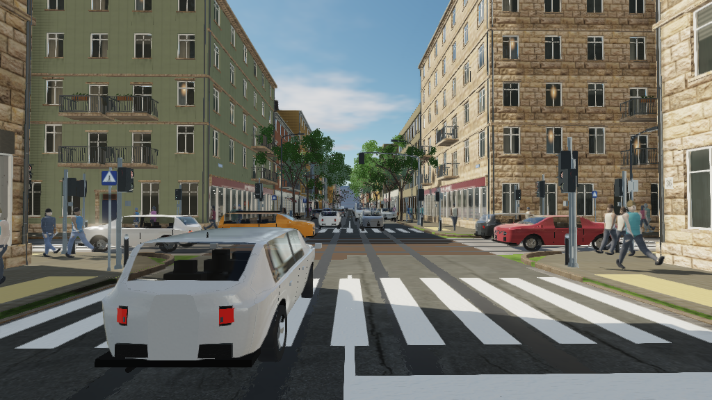 |  |
| 3 | The corner block | 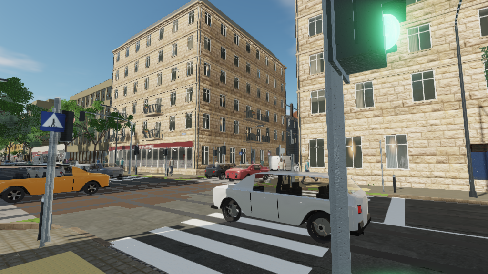 |  |
| 4 | Down the side street |  |  |
| 5 | Looking up at the façades |  | 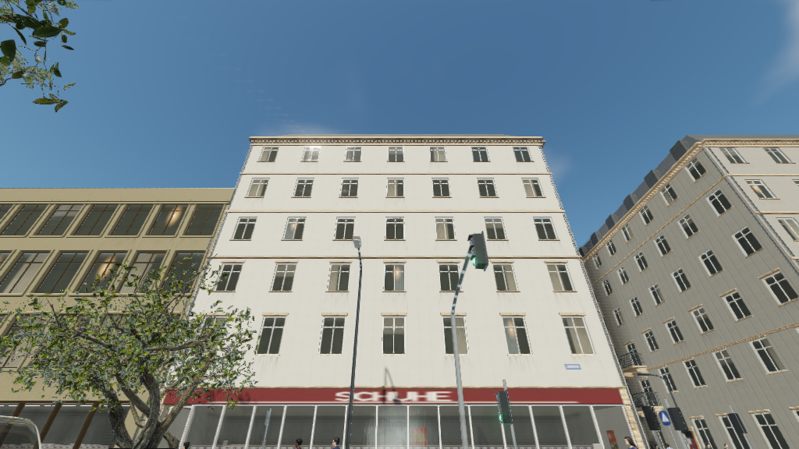 |
| 6 | Above the junction | 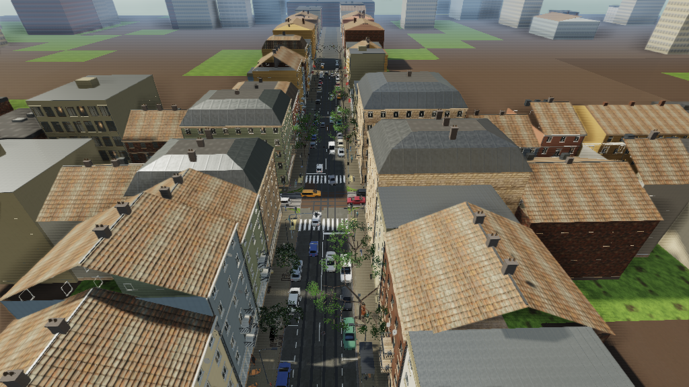 |  |
| 7 | The long view south |  |  |
| 8 | Shopfronts, close |  | 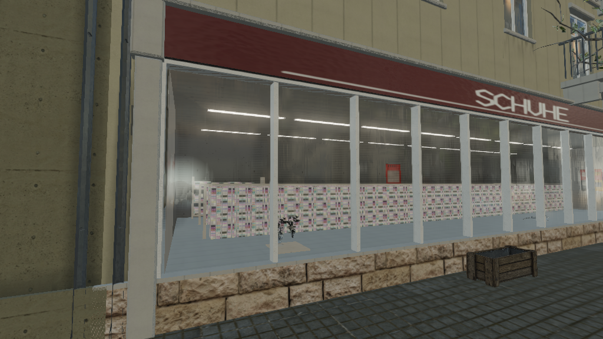 |
| 9 | Car, three metres | 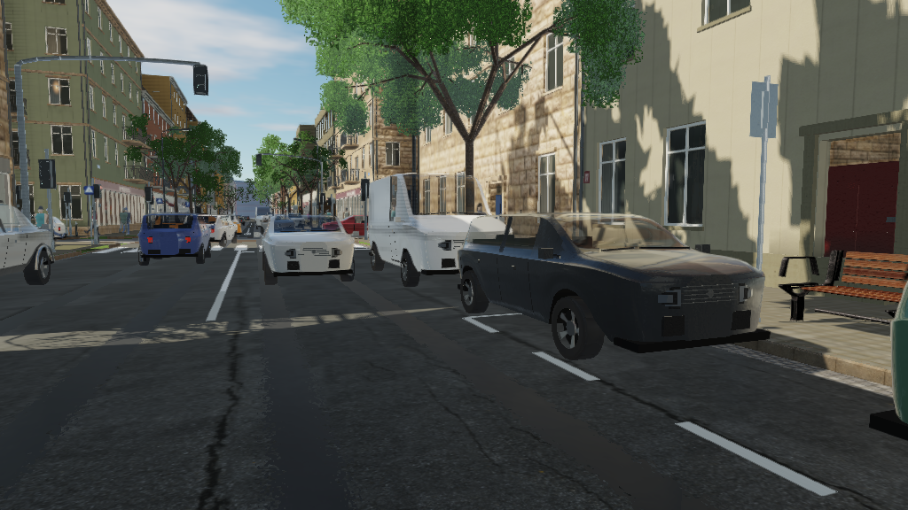 | 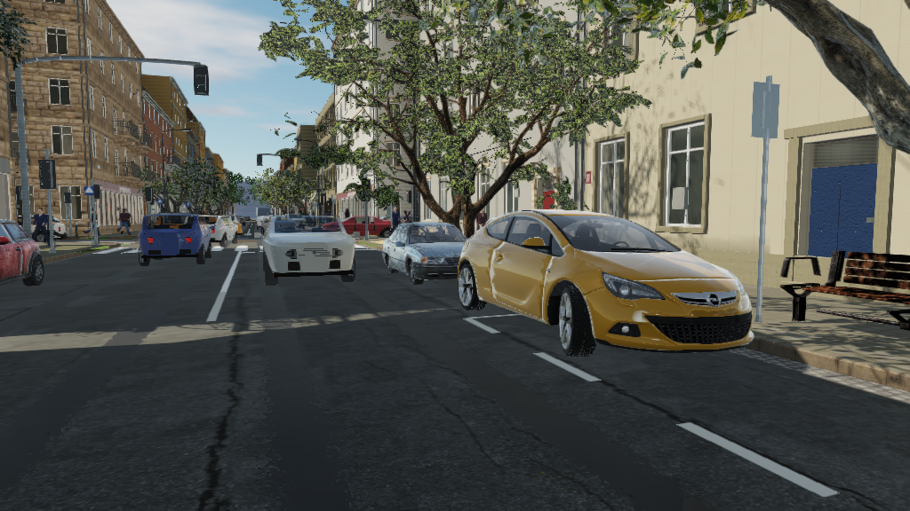 |
| 10 | Pedestrian, four metres |  |  |
| 11 | Shop window |  | 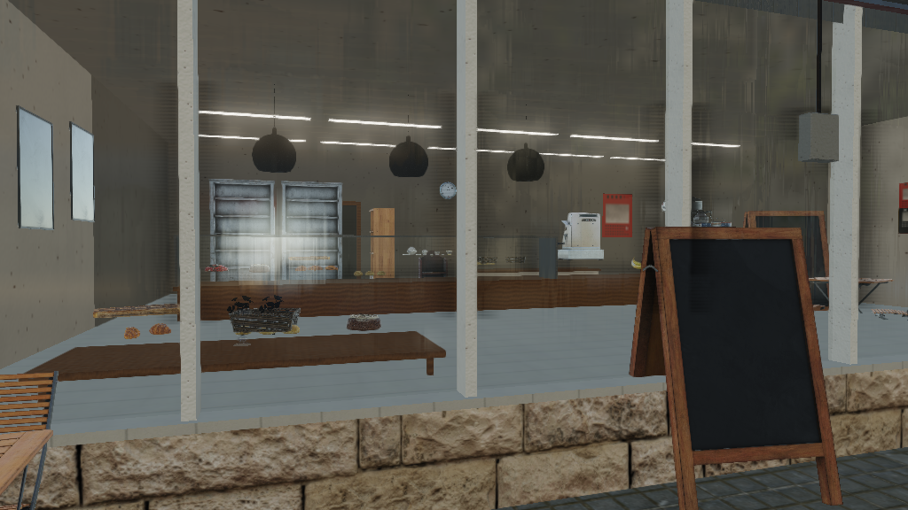 |
| 12 | Road surface |  |  |
| 13 | Street tree |  |  |
| 14 | Façade detail |  |  |
| 15 | Kerbside | 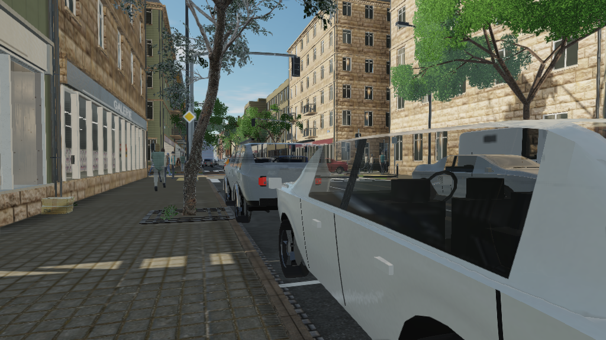 |  |
| 16 | Corner to corner |  | 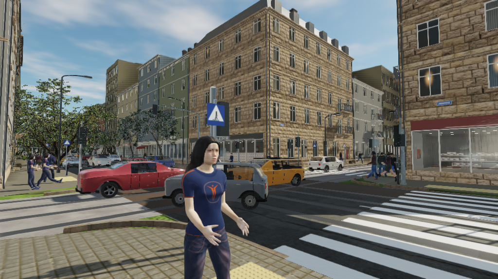 |
| 17 | Pavement cafe | 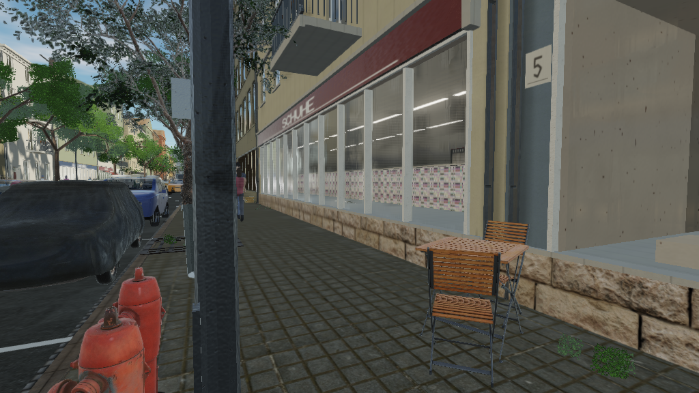 |  |
| 18 | Covered car |  |  |

`pairs/` holds each of those as one image, before on the left and after on the
right, which is the form the differences are easiest to see in.

## The five that matter most

1. `pairs/09-car-three-metres.png` -- a loft with a floating greenhouse
   becomes an Opel Astra GTC.
2. `pairs/15-kerbside.png` -- two lofts become a Renault Logan and a Mini,
   with a Fiat Punto and a VAZ estate beyond.
3. `pairs/10-pedestrian-four-metres.png` -- a mannequin becomes a person in a
   striped shirt and jeans.
4. `pairs/11-shop-window.png` -- shelves of packets in a lit box become a
   bakery-cafe with a counter, a case, a coffee station and a dressed window.
5. `pairs/01-footway-looking-south-to-the-junction.png` -- the whole change in
   one frame: the Civic in the bay, the island trees and the jacaranda across
   the road, the people on the footway, the pilasters on the shopfront.

## After dark

`--night` is unchanged by this pass except through what it lights.

| Viewpoint | Night |
|-----------|-------|
| On the crossing | 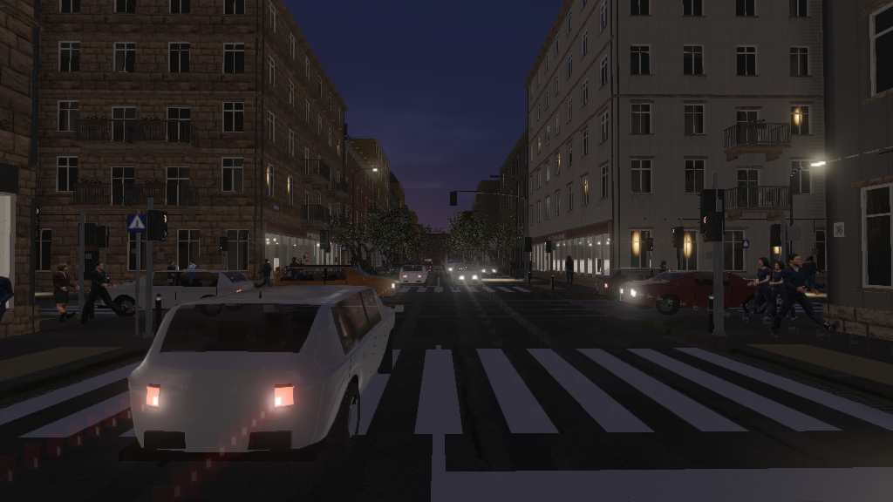 |
| Kerbside | 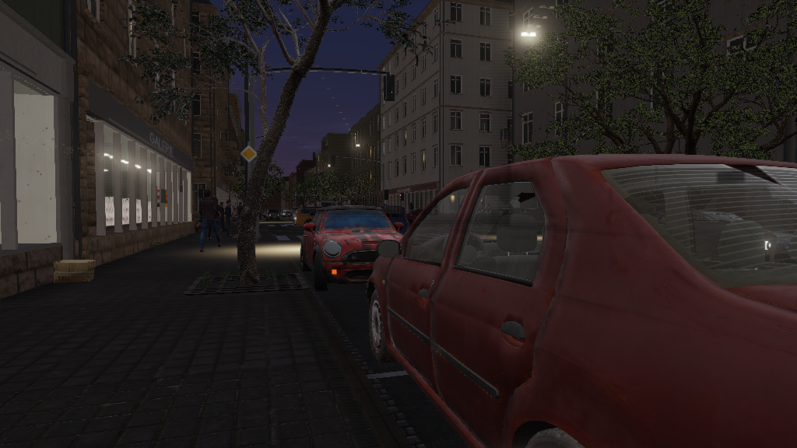 |
| Pavement cafe | 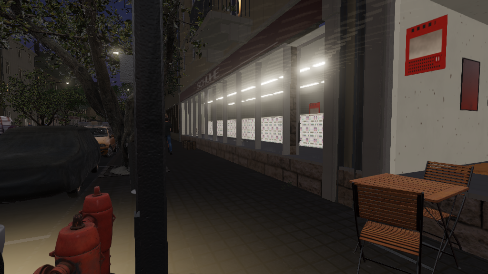 |

## Flagship

`flagship/` holds eight frames at 1920 × 1080: the footway looking south, the
car at three metres, the pedestrian at four, the shop window, the street tree,
the kerbside, the pavement cafe and the covered car.
